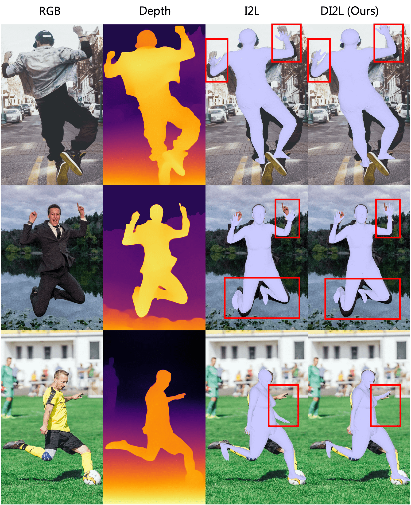
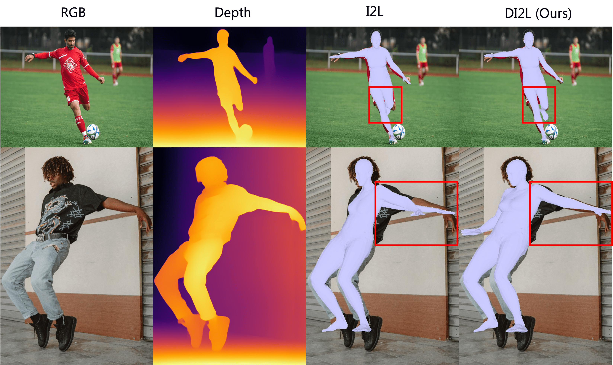

# Depth aware I2L (DI2L)

## Introduction  
This repository extends the [Image-to-Lixel](https://arxiv.org/abs/2008.03713) framework to use RGBD input to estimate 3D Pose and Mesh.
  

## Installation and datasets
Please refer to the offical installation instructions provided in the [I2L repository](https://github.com/mks0601/I2L-MeshNet_RELEASE).

### Train  
#### 1. To train the lixel stage with RGBD input
```bash  
python train.py --gpu 0 --stage lixel --rgbd
```  
#### 2. To further train the network in param stage with RGBD input
```bash  
python train.py --gpu 0-3 --stage param --rgbd --continue
```  
### Demo
For inference, use the trained weights in a folder `weights/rgb` or `weights/rgbd` in the root folder and only use the `--rgbd` flag to RGBD models.

The demo script requires a image folder with RGB images, depth maps and json files with the bounding box information and an example folder is shown below.

```
${ROOT}  
|-- demo/  
|   |-- img1.jpg        # RGB image   
|   |-- img1_depth.png  # Depth image (16 bit unsigned integer)
|   |-- img1_bbox.json  # Bounding box JSON
|   |-- img2.jpg  
|   |-- img2_depth.png
|   |-- img2_bbox.json
```

The structure of the JSON file with the bounding box information is shown below.
```
{
  'box': {
    'xmin': 0,
    'ymin': 0,
    'xmax': 100,
    'ymax': 100
  }
}
```

Use the following command to run `demo.py` script after setting up the `demo/` folder.
```bash
python demo.py --gpu 0 --stage param --test_epoch 17 --img_path ./demo --rgbd
```
  
## Results  
<p align="center">  
  
</p> 

The images ([first](https://unsplash.com/photos/p-I9wV811qk), [second](https://unsplash.com/photos/6_jORfEI7Yo) and [third](https://unsplash.com/photos/NAZOqzl9OGM)) in the qualitative results are taken from Unsplash. The depth maps are generated from the [DPT](https://github.com/intel-isl/MiDaS) network.

The following results are on images with self-occlusion.
<p align="center">  
  
</p> 

The images ([first](https://unsplash.com/photos/ztwaJXBWCC0) and [second](https://unsplash.com/photos/U8M8MX2x7Ug)) in the qualitative results are taken from Unsplash.

# Citation and acknowledgement
```
@InProceedings{Moon_2020_ECCV_I2L-MeshNet,  
author = {Moon, Gyeongsik and Lee, Kyoung Mu},  
title = {I2L-MeshNet: Image-to-Lixel Prediction Network for Accurate 3D Human Pose and Mesh Estimation from a Single RGB Image},  
booktitle = {European Conference on Computer Vision (ECCV)},  
year = {2020}  
}  
```

Most of the code used in this repo is borrowed from [I2L](https://github.com/mks0601/I2L-MeshNet_RELEASE).